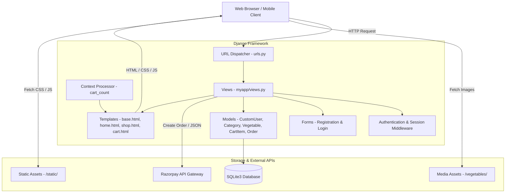
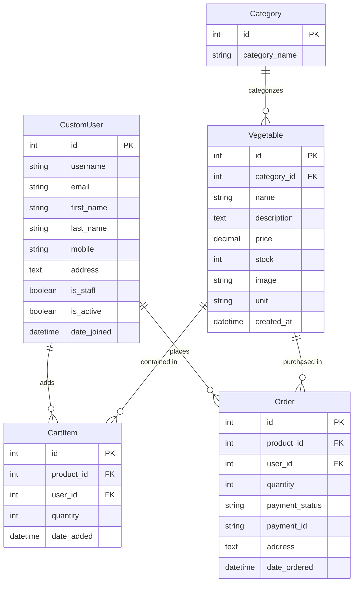

# 🥦 Organic Vegetables & Fruits E-Commerce Platform

A comprehensive full-stack e-commerce web application built with **Django (5.x/6.x compatible with Python 3.10–3.14)**, **Python**, **SQLite**, and **Bootstrap 5** (utilizing the *Fruitables* theme). 

The platform features complete user authentication, a rich 11-category catalog with 86 organic produce items, a dynamic shopping cart, Razorpay payment gateway integration, customer order history tracking, and a customized Django Admin dashboard with image thumbnail previews.

---

## 📌 Table of Contents

- [Overview](#-overview)
- [Key Features](#-key-features)
- [Produce Catalog & Categories](#-produce-catalog--categories)
- [Technology Stack](#-technology-stack)
- [System Architecture](#-system-architecture)
- [Data Models & Schema](#-data-models--schema)
- [Project Directory Structure](#-project-directory-structure)
- [Installation & Setup](#-installation--setup)
- [Network Access (Multiple Devices)](#-network-access-multiple-devices)
- [Configuration & Settings](#-configuration--settings)
- [URL Routing & Endpoints](#-url-routing--endpoints)
- [Razorpay Payment Workflow](#-razorpay-payment-workflow)
- [Troubleshooting & Compatibility](#-troubleshooting--compatibility)
- [License & Credits](#-license--credits)

---

## 📖 Overview

The **Organic Vegetables & Fruits E-Commerce Platform** connects organic produce consumers directly with farm-fresh produce. Shoppers can browse items by category, manage quantities in an active shopping cart, and securely check out using Razorpay. Store managers can monitor sales, adjust inventory and pricing in real time, and process incoming orders directly via the Django administration portal.

---

## ✨ Key Features

### 👤 1. User Management & Authentication
- **Extended User Profile**: Built on a custom `CustomUser` model inheriting from Django's `AbstractUser`, capturing customer `mobile` and delivery `address`.
- **Authentication Lifecycle**: Bootstrap-styled forms for new customer registration (`/registration`), login (`/login`), and logout (`/logout`).
- **Personalized Header**: Dynamic greeting with customer name and sign-out controls.

### 🥦 2. Produce Catalog (11 Categories, 86 Items)
- **11 Curated Categories**: Covering everything from Leafy Greens to Exotic Produce and Ready-to-Cook Pre-Cuts.
- **Dynamic Category Tabs**: Front page interactive tab navigation (Bootstrap nav-pills) allowing users to switch category views without refreshing the page.
- **Dedicated Shop Page**: Catalog view with sidebar category filtering (`/shop` and `/shop/<id>`).
- **Detailed Product Cards**: High-resolution cropped produce images, unit measurements (`Kg`, `Bundle`, `Piece`, `Gram`), inventory stock, and pricing in INR (₹).

### 🛒 3. Real-Time Shopping Cart
- **Live Cart Badge Counter**: Global context processor (`cart_count`) updating the shopping bag count badge across every navbar page in real time.
- **Cart Controls**: Add items, update quantities (1–5 units), or delete items with confirmation dialogs.
- **Automatic Calculations**: Dynamic subtotals and order totals calculated using `django-mathfilters`.

### 💳 4. Razorpay Payment Gateway
- **Checkout Modal**: Seamless integration with Razorpay Standard Checkout popup.
- **AJAX Order Creation**: Seamless delivery address submission and order initiation via JSON endpoints (`/initiate-payment/`).
- **Automatic Conversion**: Automatic currency conversion to paise (`INR`).

### 📦 5. Order Tracking & Administration
- **"My Orders" Dashboard**: Customer dashboard displaying ordered products, images, purchased quantities, prices, and status.
- **Enhanced Django Admin**:
  - Image thumbnail previews (`image_preview`) directly in the vegetable table list.
  - In-line editable stock and price for fast inventory adjustments.
  - Searchable by product name, user details, and delivery address.
  - Filters by category, creation date, and payment status.

---

## 🥕 Produce Catalog & Categories

The database includes **86 pre-configured organic produce items** across **11 categories**:

| # | Category | Count | Sample Items | Units |
|---|---|:---:|---|---|
| 1 | **Leafy Vegetables** | 8 | Spinach, Amaranth Leaves, Mustard Greens, Coriander, Mint, Fenugreek, Lettuce, Kale | Bundle, Piece |
| 2 | **Root Vegetables** | 8 | Potato, Carrot, Beetroot, Radish, Turnip, Sweet Potato, Yam, Colocasia (Taro) | Kg |
| 3 | **Bulbs & Alliums** | 6 | Onion, Garlic, Spring Onion, Leek, Shallots, Chives | Kg, Bundle, Piece |
| 4 | **Fruiting Vegetables** | 8 | Tomato, Brinjal, Capsicum, Chilli, Cucumber, Bitter Gourd, Bottle Gourd, Ridge Gourd | Kg, Gram, Piece |
| 5 | **Cabbage & Cruciferous** | 8 | Cabbage, Cauliflower, Broccoli, Brussels Sprouts, Red Cabbage, Chinese Cabbage, Kohlrabi, Romanesco | Piece, Kg |
| 6 | **Beans & Legumes** | 8 | Green Beans, French Beans, Broad Beans, Cowpeas, Cluster Beans, Lima Beans, Chickpeas, Black Gram | Kg |
| 7 | **Herbs & Sprouts** | 8 | Basil Leaves, Thyme, Rosemary, Dilli, Spring Mix, Microgreens, Methi Sprouts, Moong Sprouts | Bundle, Gram |
| 8 | **Specialty / Exotic Vegetables** | 8 | Artichoke, Asparagus, Fennel, Baby Corn, Zucchini, Pattypan Squash, Okra, Karela | Piece, Bundle, Kg |
| 9 | **Salad Vegetables** | 8 | Iceberg Lettuce, Romaine Lettuce, Cherry Tomato, Cucumber, Bell Pepper, Red Cabbage, Carrot, Radish | Piece, Kg |
| 10 | **Seasonal Specials** | 8 | Seasonal Karela, Tinda, Parwal, Seem, Jhinga, Suran, Pumpkin, Chow Chow | Kg |
| 11 | **Pre-Cut & Ready to Cook** | 8 | Mixed Veg (Cut), Chopped Onions, Chopped Tomatoes, Vegetable Mix, Frozen Peas, Sweet Corn, Baby Corn, Mixed Salad | Piece |

---

## 🛠️ Technology Stack

| Component | Technology | Description |
|---|---|---|
| **Backend** | Python 3.10 – 3.14 | Core programming language |
| **Framework** | Django 5.x / 6.x | Robust Model-View-Template web framework |
| **Database** | SQLite3 | Default local database (`db.sqlite3`) |
| **Payment Gateway** | Razorpay Python SDK | Online payment processing |
| **Image Processing** | Pillow (PIL) | Dynamic image handling and cropping |
| **Template Enhancements** | `django-mathfilters` | Template arithmetic for real-time order math |
| **Frontend Framework** | Bootstrap 5 | Modern responsive grid and UI components |
| **Icons & Fonts** | FontAwesome 5 & Bootstrap Icons | Vector icons |
| **Client-Side Libraries** | jQuery, Owl Carousel, Lightbox | Interactive sliders, carousels, and AJAX |

---

## 🏗️ System Architecture



---

## 🗄️ Data Models & Schema



---

## 📁 Project Directory Structure

```text
vegitable/
│
├── manage.py                          # Django management CLI script
├── db.sqlite3                         # Local SQLite database (pre-populated)
├── requirements.txt                   # Project Python dependencies (Django>=5.0)
├── README.md                          # Comprehensive project documentation
│
├── myapp/                             # Core grocery application
│   ├── migrations/                    # Database migrations
│   │   ├── 0001_initial.py            # Initial schema: CustomUser, Category, Vegetable
│   │   └── 0002_order_cartitem.py     # Schema for Order and CartItem
│   ├── admin.py                       # Admin panel with image preview & in-line editing
│   ├── apps.py                        # App configuration
│   ├── context_processors.py          # Real-time cart badge counter
│   ├── forms.py                       # UserRegistration and UserLogin forms
│   ├── models.py                      # CustomUser, Category, Vegetable, CartItem, Order
│   ├── urls.py                        # App route declarations
│   └── views.py                       # Business logic for auth, catalog, cart, checkout
│
├── static/                            # Static frontend assets
│   ├── css/                           # Bootstrap & custom styling (style.css)
│   ├── js/                            # JavaScript files (main.js)
│   ├── img/                           # Banners, hero graphics, payment icons
│   └── lib/                           # Vendor plugins (owlcarousel, lightbox, easing)
│
├── templates/                         # HTML templates
│   ├── base.html                      # Base template, navbar, footer, Razorpay script
│   ├── home.html                      # Homepage with hero slider and category tabs
│   ├── shop.html                      # Catalog with sidebar category filters
│   ├── cart.html                      # Shopping cart and checkout form
│   ├── my_orders.html                 # Customer purchase history
│   ├── login.html                     # Customer authentication page
│   ├── registration.html              # Customer registration page
│   ├── contact.html                   # Contact information & support details
│   └── payment_success.html           # Payment callback landing page
│
├── vegetables/                        # Uploaded and cropped produce images
│
└── vegitable/                         # Project settings & routing package
    ├── asgi.py                        # ASGI configuration for async deployments
    ├── wsgi.py                        # WSGI configuration for web servers
    ├── settings.py                    # Settings, ALLOWED_HOSTS, MEDIA_ROOT, Razorpay keys
    └── urls.py                        # Root URL routing + media serving
```

---

## 🚀 Installation & Setup

### Prerequisites
- **Python 3.10, 3.11, 3.12, 3.13, or 3.14**
- `pip` package manager

### 1. Clone or Open the Project
```bash
cd /path/to/vegitable/vegitable
```

### 2. Set Up a Virtual Environment (Recommended)
- **On Windows (PowerShell):**
  ```powershell
  python -m venv venv
  .\venv\Scripts\Activate.ps1
  ```
- **On macOS / Linux:**
  ```bash
  python3 -m venv venv
  source venv/bin/activate
  ```

### 3. Install Dependencies
Install all required packages from `requirements.txt`:
```bash
pip install -r requirements.txt
```
*(Packages installed: `Django>=5.0`, `django-mathfilters`, `razorpay`, `Pillow`)*.

### 4. Run Database Migrations
```bash
python manage.py migrate
```

### 5. Create an Administrator Superuser (Optional)
```bash
python manage.py createsuperuser
```

### 6. Start the Development Server
- **For local testing on your machine:**
  ```bash
  python manage.py runserver
  ```
- **For access from other computers/phones on the same Wi-Fi:**
  ```bash
  python manage.py runserver 0.0.0.0:8000
  ```

---

## 📱 Network Access (Multiple Devices)

To access the web store from another laptop, phone, or tablet connected to the same Wi-Fi network:

1. **Find your computer's IP address**:
   - On Windows, open PowerShell/CMD and type `ipconfig`. Look for **IPv4 Address** (e.g., `192.168.1.50`).
   - On Mac/Linux, run `ifconfig` or `ip a`.
2. **Start the server bound to all interfaces**:
   ```bash
   python manage.py runserver 0.0.0.0:8000
   ```
3. **Open the browser on the other device**:
   - Storefront: `http://192.168.1.50:8000/`
   - Admin Panel: `http://192.168.1.50:8000/admin/`

> [!NOTE]
> `ALLOWED_HOSTS = ['*']` is already enabled in `vegitable/settings.py` so external network requests are accepted without `DisallowedHost` errors.

---

## ⚙️ Configuration & Settings

Key configurations reside in `vegitable/settings.py`:

| Setting | Value | Description |
|---|---|---|
| `ALLOWED_HOSTS` | `['*']` | Allows connections from localhost and other LAN devices |
| `AUTH_USER_MODEL` | `'myapp.CustomUser'` | Custom user model with phone and address |
| `MEDIA_URL` | `'/media/'` | Public URL prefix for produce images |
| `MEDIA_ROOT` | `BASE_DIR` | Root directory where `vegetables/` media resides |
| `RAZORPAY_API_KEY` | `rzp_test_...` | Razorpay Test API Key |
| `RAZORPAY_API_SECRET` | `zAh1Tu...` | Razorpay Test API Secret |

---

## 🛣️ URL Routing & Endpoints

| URL Pattern | View Function | Route Name | Description |
|---|---|---|---|
| `/` | `views.home` | `home-page` | Landing page with hero banner & category tabs |
| `/shop` | `views.shop` | `shop-page` | All produce catalog with category filter sidebar |
| `/shop/<int:id>` | `views.shopCat` | `shop-cat-page` | Produce catalog filtered by category ID |
| `/registration` | `views.userReg` | `reg-page` | New customer account registration |
| `/login` | `views.userLogin` | `log-page` | Customer login |
| `/logout` | `views.userLogout` | `logout-page` | Customer logout & redirect |
| `/addtocart/<int:id>` | `views.add_to_cart` | `addtocart` | Adds product to cart or increments quantity |
| `/cart` | `views.view_cart` | `crt-page` | Cart items, subtotal calculation, checkout form |
| `/cart/update/<int:item_id>/` | `views.update_cart` | `update_cart` | Modifies item quantity (1–5 units) |
| `/cart/delete/<int:item_id>/` | `views.delete_cart_item` | `delete_cart_item` | Deletes an item from cart |
| `/initiate-payment/` | `views.initiate_payment` | `initiate_payment` | Generates Razorpay order & returns JSON config |
| `/payment-success/` | `views.payment_success` | `payment_success` | Payment success callback |
| `/my-orders` | `views.my_orders` | `my_orders` | Customer order history dashboard |
| `/contact` | `views.contact` | `cont-page` | Customer support & contact details |
| `/admin/` | `admin.site.urls` | `admin` | Django administration dashboard |

---

## 💳 Razorpay Payment Workflow

1. **Address Entry**: Customer inputs their delivery address in the cart summary form on `/cart`.
2. **Order Initiation**: On clicking **Pay Now**, an AJAX POST request with CSRF verification is dispatched to `/initiate-payment/`.
3. **Razorpay API Call**: The server creates a payment order via the Razorpay Python SDK with amount converted to paise.
4. **Checkout Modal**: The Razorpay Checkout popup opens on the client with the received `order_id`.
5. **Order Persistence**: Order records are created with the selected delivery address and the cart is emptied.
6. **Redirect**: Upon payment completion, the client is redirected to `/my-orders`.

---

## 🔧 Troubleshooting & Compatibility

### 1. Python 3.14 Compatibility (`AttributeError: 'super' object has no attribute 'dicts'`)
- **Cause**: Older Django versions (such as Django 4.2) are incompatible with Python 3.14's changes to `super()` in `django/template/context.py`.
- **Solution**: Upgrade Django to version 5.0 or newer:
  ```bash
  pip install --upgrade django
  ```

### 2. Missing Produce Images on Other Devices
- Make sure `MEDIA_URL = '/media/'` and `MEDIA_ROOT = BASE_DIR` are present in `vegitable/settings.py`.
- Verify `urls.py` contains:
  ```python
  + static(settings.MEDIA_URL, document_root=settings.MEDIA_ROOT)
  ```

### 3. Populating Produce Items
If setting up a fresh database from scratch, run the population script:
```bash
python scratch/populate_vegetables.py
```
This automatically crops all 86 produce photos and populates the 11 categories in the database.

---

## 📜 License & Credits

- **Design & Layout**: Bootstrap 5 Fruitables Template by [HTML Codex](https://htmlcodex.com).
- **Backend Architecture**: Django Full-Stack E-Commerce with Razorpay Integration.
