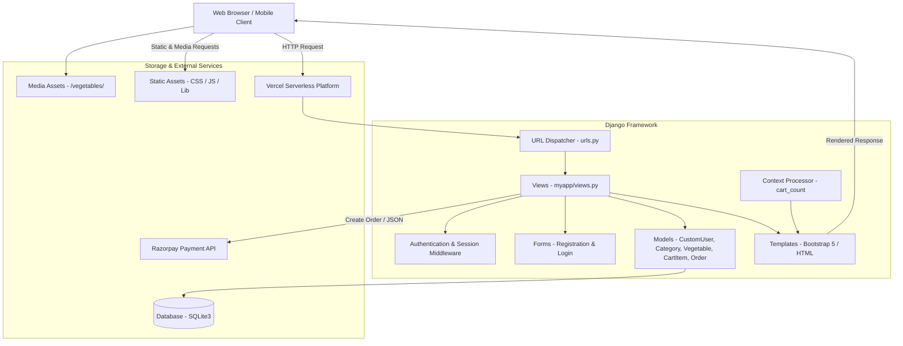
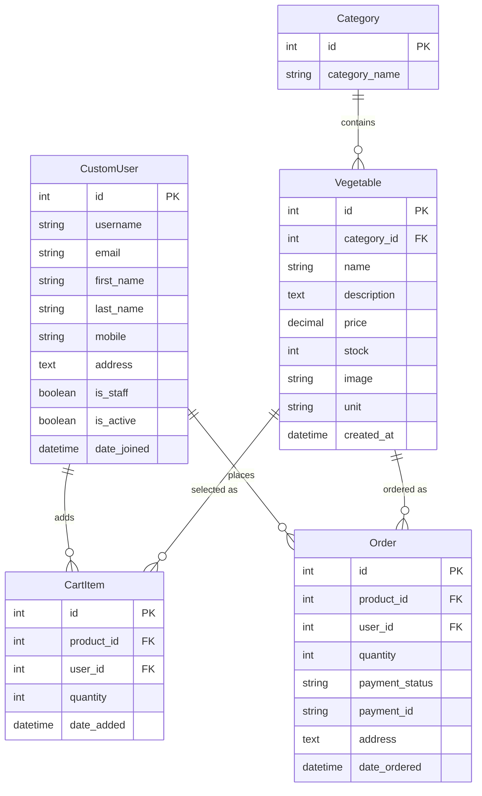

# 🥦 Organic Vegetables & Fruits E-Commerce Platform

[](https://vg-miaraj.vercel.app)
[](https://www.djangoproject.com/)
[](https://www.python.org/)
[](https://getbootstrap.com/)
[](https://razorpay.com/)

A modern, full-stack e-commerce web platform for farm-fresh organic produce built with **Django**, **Python**, **SQLite**, and **Bootstrap 5** (utilizing the *Fruitables* theme). The application delivers an end-to-end shopping experience featuring secure user authentication, an extensive 11-category catalog with 86 organic items, real-time cart state management, Razorpay payment gateway integration, customer order history, and an enhanced Django Admin control panel with thumbnail previews.

---

## 🔗 Quick Links

- 🌐 **Live Website (Vercel):** [https://vg-miaraj.vercel.app](https://vg-miaraj.vercel.app)
- 📂 **GitHub Repository:** [https://github.com/miarajsk18-stack/vg](https://github.com/miarajsk18-stack/vg)

---

## 📌 Table of Contents

- [Overview](#-overview)
- [Key Features](#-key-features)
- [Technology Stack](#-technology-stack)
- [Produce Catalog & Categories](#-produce-catalog--categories)
- [System Architecture](#-system-architecture)
- [Data Models & Schema](#-data-models--schema)
- [Project Directory Structure](#-project-directory-structure)
- [Local Installation & Setup](#-local-installation--setup)
- [Vercel Deployment Guide](#-vercel-deployment-guide)
- [URL Routing & Endpoints](#-url-routing--endpoints)
- [Razorpay Payment Workflow](#-razorpay-payment-workflow)
- [Configuration & Settings](#-configuration--settings)
- [Troubleshooting & FAQs](#-troubleshooting--faqs)
- [Author & License](#-author--license)

---

## 📖 Overview

The **Organic Vegetables & Fruits E-Commerce Platform** connects health-conscious consumers directly with farm-fresh produce. Customers can browse produce by categories, filter items dynamically, manage order quantities in an interactive cart, and pay securely via Razorpay. Administrators can manage stock, update prices inline, preview produce photos, and track customer orders directly through the customized Django Administration panel.

---

## ✨ Key Features

### 👤 1. User Management & Authentication
- **Custom User Model**: Built on `CustomUser` (subclass of Django's `AbstractUser`) to capture essential customer details like `mobile` phone and delivery `address`.
- **Complete Auth Flow**: Responsive, user-friendly forms for customer registration (`/registration`), login (`/login`), and session logout (`/logout`).
- **Personalized Header**: Dynamic navbar reflecting login state, showing customer name, cart item counter, and fast sign-out controls.

### 🥦 2. Rich Catalog (11 Categories, 86 Items)
- **11 Curated Categories**: From Leafy Greens and Root Vegetables to Exotic Produce and Ready-to-Cook items.
- **Interactive Category Filtering**: Homepage tabs (nav-pills) and dedicated shop sidebar (`/shop` and `/shop/<category_id>`) for instant browsing.
- **Detailed Product Cards**: High-definition produce images, flexible units (`Kg`, `Gram`, `Piece`, `Dozen`, `Bundle`), pricing in INR (₹), and in-stock inventory indicators.

### 🛒 3. Real-Time Shopping Cart
- **Dynamic Cart Counter**: Global context processor (`cart_count`) updates the cart badge counter across all pages in real-time.
- **Item Modification**: Easy item addition from product cards, quantity increments/decrements (1–5 units), and item removal with feedback messages.
- **Live Price Calculation**: Subtotals and grand total calculated cleanly via `django-mathfilters`.

### 💳 4. Razorpay Payment Gateway Integration
- **Direct Checkout Integration**: Secure checkout modal powered by the Razorpay JavaScript SDK.
- **AJAX Order Creation**: Endpoint (`/initiate-payment/`) securely prepares orders and passes configuration (Key, Currency, Order ID, Amount in paise) to the client.
- **Instant Order Recording**: Creates order entries tied to the authenticated user upon confirmation and automatically flushes the shopping cart.

### 📦 5. Customer Dashboard & Django Admin
- **"My Orders" Page**: Allows logged-in users to review past purchases, delivery addresses, dates, and order status.
- **Custom Admin Interface**:
  - Image thumbnails (`image_preview`) displayed directly in the Vegetable table.
  - In-line editable price and stock fields for fast inventory adjustments.
  - Filterable by category, date, and payment status.
  - Searchable by product name, customer username, and address.

---

## 🛠️ Technology Stack

| Layer | Technology | Details / Usage |
|---|---|---|
| **Backend** | Python 3.10 – 3.14 | Core programming language |
| **Framework** | Django 5.x / 6.x | Robust Model-View-Template architecture |
| **Database** | SQLite3 | Local & development database (`db.sqlite3`) |
| **Payment Gateway** | Razorpay Python SDK | Online payment processing & verification |
| **Image Processing** | Pillow (PIL) | Dynamic image uploads and manipulation |
| **Template Helpers** | `django-mathfilters` | Arithmetic expressions directly in Django templates |
| **Deployment / Hosting** | Vercel | Serverless cloud hosting platform |
| **Frontend Framework** | Bootstrap 5 | Modern responsive grid, modals, and utilities |
| **UI Theme** | Fruitables Theme | Clean, nature-inspired e-commerce UI design |
| **Icons & Fonts** | FontAwesome 5 & Google Fonts | Crisp typography and vector icons |
| **JavaScript Plugins** | jQuery, Owl Carousel, Lightbox | Sliders, hero carousels, and image popups |

---

## 🥕 Produce Catalog & Categories

The platform includes **86 curated produce items** organized into **11 distinct categories**:

| # | Category | Count | Sample Items | Default Unit |
|---|---|:---:|---|---|
| 1 | **Leafy Vegetables** | 8 | Spinach, Amaranth Leaves, Mustard Greens, Coriander, Mint, Fenugreek, Lettuce, Kale | Bundle / Piece |
| 2 | **Root Vegetables** | 8 | Potato, Carrot, Beetroot, Radish, Turnip, Sweet Potato, Yam, Colocasia | Kg |
| 3 | **Bulbs & Alliums** | 6 | Onion, Garlic, Spring Onion, Leek, Shallots, Chives | Kg / Bundle |
| 4 | **Fruiting Vegetables** | 8 | Tomato, Brinjal, Capsicum, Chilli, Cucumber, Bitter Gourd, Bottle Gourd, Ridge Gourd | Kg / Gram |
| 5 | **Cabbage & Cruciferous** | 8 | Cabbage, Cauliflower, Broccoli, Brussels Sprouts, Red Cabbage, Chinese Cabbage, Kohlrabi, Romanesco | Piece / Kg |
| 6 | **Beans & Legumes** | 8 | Green Beans, French Beans, Broad Beans, Cowpeas, Cluster Beans, Lima Beans, Chickpeas, Black Gram | Kg |
| 7 | **Herbs & Sprouts** | 8 | Basil Leaves, Thyme, Rosemary, Dilli, Spring Mix, Microgreens, Methi Sprouts, Moong Sprouts | Bundle / Gram |
| 8 | **Specialty & Exotic** | 8 | Artichoke, Asparagus, Fennel, Baby Corn, Zucchini, Pattypan Squash, Okra, Karela | Piece / Kg |
| 9 | **Salad Vegetables** | 8 | Iceberg Lettuce, Romaine Lettuce, Cherry Tomato, Cucumber, Bell Pepper, Red Cabbage, Carrot, Radish | Piece / Kg |
| 10 | **Seasonal Specials** | 8 | Seasonal Karela, Tinda, Parwal, Seem, Jhinga, Suran, Pumpkin, Chow Chow | Kg |
| 11 | **Pre-Cut & Ready-to-Cook** | 8 | Mixed Veg (Cut), Chopped Onions, Chopped Tomatoes, Frozen Peas, Sweet Corn, Baby Corn, Mixed Salad | Piece / Pack |

---

## 🏗️ System Architecture



---

## 🗄️ Data Models & Schema



---

## 📁 Project Directory Structure

```text
vegitable/
│
├── manage.py                          # Django management CLI script
├── db.sqlite3                         # SQLite database with preloaded catalog
├── requirements.txt                   # Project Python dependencies
├── README.md                          # Comprehensive documentation
├── .gitignore                         # Git ignore configuration
├── data.json                          # Content types & permissions fixture
│
├── myapp/                             # Core grocery application
│   ├── migrations/                    # Schema migrations
│   │   ├── 0001_initial.py            # Initial schema: CustomUser, Category, Vegetable
│   │   └── 0002_order_cartitem.py     # Schema: Order, CartItem
│   ├── admin.py                       # Admin panel with image preview & inline editing
│   ├── apps.py                        # App configuration
│   ├── context_processors.py          # Real-time cart badge counter
│   ├── forms.py                       # Customer registration and login forms
│   ├── models.py                      # CustomUser, Category, Vegetable, CartItem, Order
│   ├── urls.py                        # App route declarations
│   └── views.py                       # Business logic for auth, cart, catalog, checkout
│
├── static/                            # Frontend assets
│   ├── css/                           # Bootstrap & custom styling (style.css)
│   ├── js/                            # JavaScript files (main.js)
│   ├── img/                           # Banners, hero graphics, payment badges
│   └── lib/                           # Plugins (owlcarousel, lightbox, easing)
│
├── templates/                         # HTML templates
│   ├── base.html                      # Layout, navbar, footer, Razorpay scripts
│   ├── home.html                      # Landing page with hero slider & category tabs
│   ├── shop.html                      # Catalog with sidebar category filters
│   ├── cart.html                      # Shopping cart and checkout form
│   ├── my_orders.html                 # Customer purchase history dashboard
│   ├── login.html                     # Customer sign-in page
│   ├── registration.html              # Customer registration page
│   ├── contact.html                   # Contact & support page
│   └── payment_success.html           # Payment callback landing page
│
├── vegetables/                        # Uploaded and cropped produce images
│
└── vegitable/                         # Project settings & routing configuration
    ├── asgi.py                        # ASGI configuration
    ├── wsgi.py                        # WSGI entrypoint for web servers
    ├── settings.py                    # Settings, ALLOWED_HOSTS, MEDIA_ROOT, Razorpay keys
    └── urls.py                        # Root URL routing + media serving
```

---

## 🚀 Local Installation & Setup

### Prerequisites
- **Python 3.10 – 3.14**
- `pip` package manager
- `git` version control

### 1. Clone the Repository
```bash
git clone https://github.com/miarajsk18-stack/vg.git
cd vg
```

### 2. Create and Activate a Virtual Environment
- **On Windows (PowerShell):**
  ```powershell
  python -m venv venv
  .\venv\Scripts\Activate.ps1
  ```
- **On macOS / Linux:**
  ```bash
  python3 -m venv venv
  source venv/bin/activate
  ```

### 3. Install Dependencies
```bash
pip install -r requirements.txt
```
*(Dependencies: `Django>=5.0`, `django-mathfilters`, `razorpay`, `Pillow`)*

### 4. Run Database Migrations
```bash
python manage.py migrate
```

### 5. Create an Administrator Superuser
```bash
python manage.py createsuperuser
```

### 6. Start the Local Server
```bash
python manage.py runserver
```
Visit `http://127.0.0.1:8000/` in your browser.

---

## ☁️ Vercel Deployment Guide

The application is deployed on Vercel at: **[https://vg-miaraj.vercel.app](https://vg-miaraj.vercel.app)**.

### Configuring Vercel for Django:
To deploy or update Django on Vercel:

1. **Vercel Configuration (`vercel.json`)**:
   Add a `vercel.json` file to the root directory specifying the WSGI handler:
   ```json
   {
     "version": 2,
     "builds": [
       {
         "src": "vegitable/wsgi.py",
         "use": "@vercel/python",
         "config": { "maxLambdaSize": "15mb", "runtime": "python3.11" }
       }
     ],
     "routes": [
       {
         "src": "/static/(.*)",
         "dest": "/static/$1"
       },
       {
         "src": "/(.*)",
         "dest": "vegitable/wsgi.py"
       }
     ]
   }
   ```

2. **Environment Variables**:
   In your Vercel Dashboard (**Project ➡️ Settings ➡️ Environment Variables**), configure:
   - `SECRET_KEY`: Your production Django secret key
   - `DEBUG`: `False` (for production)
   - `RAZORPAY_API_KEY`: Your Razorpay public API key
   - `RAZORPAY_API_SECRET`: Your Razorpay secret key

3. **Public Access (Disabling Vercel Authentication / Protected Deployment)**:
   If your live link prompts visitors with a *"Log in to Vercel"* or *"Protected Deployment"* screen:
   - Go to **[Vercel Dashboard](https://vercel.com/dashboard)**.
   - Select the project (**`vg-miaraj`** or **`vg`**).
   - Go to **Settings** ➡️ **Deployment Protection**.
   - Under **Vercel Authentication**, toggle it **Disabled** (or configure password protection as needed) so visitors can view your website publicly without logging into Vercel.

---

## 🛣️ URL Routing & Endpoints

| URL Pattern | View Function | Route Name | Description |
|---|---|---|---|
| `/` | `views.home` | `home-page` | Landing page with hero banner & category tabs |
| `/shop` | `views.shop` | `shop-page` | Full produce catalog with category filter sidebar |
| `/shop/<int:id>` | `views.shopCat` | `shop-cat-page` | Catalog filtered by selected category ID |
| `/registration` | `views.userReg` | `reg-page` | New customer account registration |
| `/login` | `views.userLogin` | `log-page` | Customer login |
| `/logout` | `views.userLogout` | `logout-page` | Customer session sign-out |
| `/addtocart/<int:id>` | `views.add_to_cart` | `addtocart` | Adds product to cart or increments quantity |
| `/cart` | `views.view_cart` | `crt-page` | Cart items, subtotal calculation, checkout form |
| `/cart/update/<int:item_id>/` | `views.update_cart` | `update_cart` | Modifies item quantity (1–5 units) |
| `/cart/delete/<int:item_id>/` | `views.delete_cart_item` | `delete_cart_item` | Removes item from cart |
| `/initiate-payment/` | `views.initiate_payment` | `initiate_payment` | Generates Razorpay order & returns JSON config |
| `/payment-success/` | `views.payment_success` | `payment_success` | Payment success callback |
| `/my-orders` | `views.my_orders` | `my_orders` | Customer order history dashboard |
| `/contact` | `views.contact` | `cont-page` | Contact support and location information |
| `/admin/` | `admin.site.urls` | `admin` | Django administration portal |

---

## 💳 Razorpay Payment Workflow

1. **Address Submission**: The customer enters their delivery address in the cart summary on `/cart`.
2. **Order Creation Request**: Clicking **Pay Now** sends an AJAX POST request with CSRF verification to `/initiate-payment/`.
3. **Razorpay Order Initiation**: The server creates an order via the Razorpay Python SDK with the amount converted to paise.
4. **Checkout Modal**: The Razorpay Checkout popup appears on the screen with the order ID.
5. **Database Persistence**: Order records are created with the customer's delivery address, and items are cleared from the cart.
6. **Confirmation**: Upon successful payment, the user is redirected to `/my-orders` to view their purchase history.

---

## ⚙️ Configuration & Settings

Key configurations reside in `vegitable/settings.py`:

| Parameter | Configuration | Purpose |
|---|---|---|
| `ALLOWED_HOSTS` | `['*']` | Allows requests from localhost, LAN devices, and cloud hosts |
| `AUTH_USER_MODEL` | `'myapp.CustomUser'` | Custom user model supporting phone number and address |
| `MEDIA_URL` | `'/media/'` | Public URL prefix for produce images |
| `MEDIA_ROOT` | `BASE_DIR` | Directory where vegetable image assets reside |
| `RAZORPAY_API_KEY` | `rzp_test_...` | Razorpay Test API Key |
| `RAZORPAY_API_SECRET` | `zAh1Tu...` | Razorpay Test API Secret |
| `SECURE_CROSS_ORIGIN_OPENER_POLICY` | `"same-origin-allow-popups"` | Enables seamless Razorpay popup communication |

---

## 🔧 Troubleshooting & FAQs

### 1. Vercel shows "Protected Deployment / Log in to Vercel"
- **Solution:** Open your [Vercel Dashboard](https://vercel.com) ➡️ Navigate to **Settings** ➡️ **Deployment Protection** ➡️ Turn off **Vercel Authentication**.

### 2. Missing Produce Images in Production
- **Cause:** Serverless environments (like Vercel) have read-only filesystems and do not persist local uploads permanently.
- **Solution:** For production image hosting, integrate cloud storage such as AWS S3, Cloudinary, or Supabase Storage via `django-storages`.

### 3. Python 3.14 Compatibility (`AttributeError: 'super' object has no attribute 'dicts'`)
- **Solution:** Ensure you are running Django 5.0 or higher (`Django>=5.0`), which contains the fix for Python 3.14's template context handling.

---

## 📜 Author & License

- **Developer:** [miarajsk18-stack](https://github.com/miarajsk18-stack)
- **Frontend Theme:** Fruitables Template by [HTML Codex](https://htmlcodex.com)
- **Backend Architecture:** Django Full-Stack E-Commerce with Razorpay Integration
